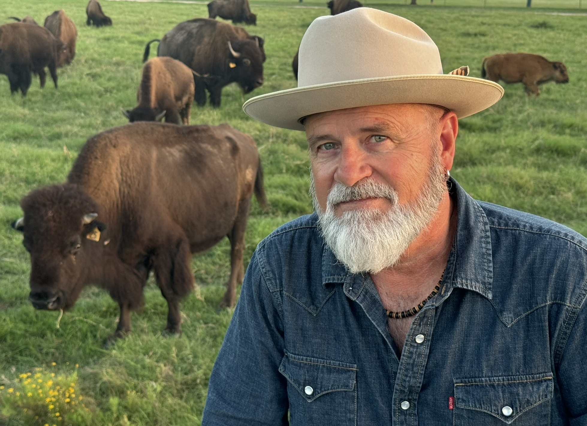

# About

John Krajicek is a singer-songwriter, visual artist, host of the video podcast Time to Connect (YouTube), Mindfulness & Emotional Intelligence coach, and a semi-retired Professor (Texas A&M).

Born in Leavenworth, Kansas. Enchanted by Dylan and Lennon in his youth. College years in Denton, TX. Obsessively writes songs. Loves to play live.

Townes Van Zandt, John Prine, Guy Clark, The Felice Brothers, Wilco, Will Johnson, Centro-matic, The Band, REM, Neil Young, The Byrds, Dylan, Lennon, on and on.

"Life isn't about finding yourself; or finding anything. Life is about creating yourself; and creating things." (Dylan)