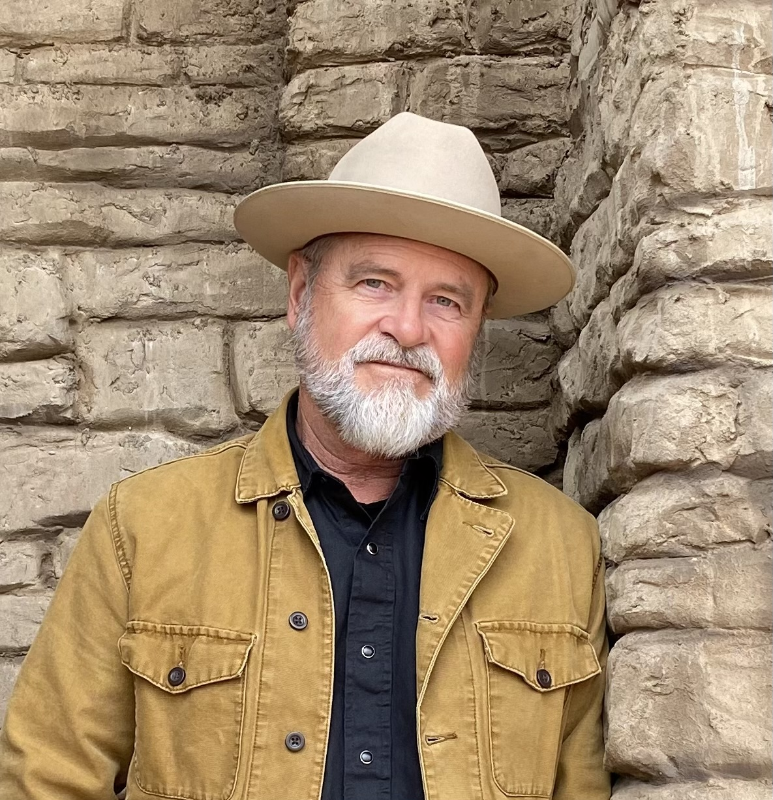

# About

John is a singer-songwriter, performer, visual artist, and host of the video podcast Time to Connect (YouTube channel).

We all stand on the shoulders of giants, and like all singer-songwriters, John is heavily influenced by a wide variety of artists, beginning in his youth with The Beatles and Bob Dylan. Through the years, his influences have included John Prine, REM, Leonard Cohen, Joni Mitchell, Paul Simon, Tom Petty, Townes Van Zandt, Jeff Tweedy, Will Johnson, Big Thief, Jason Lytle, Jason Isbell, Jack Kerouac, Rick Bass, William Goyen, Jim Harrison, Wallace Stevens, Elizabeth Bishop, Mary Oliver, Billy Collins, and on and on.

John's motto is "always be creating", and he is constantly writing. He knows that melody is king in this process, but he is equally fascinated by language, by the way we can process emotions, memories, and experiences into words and images. A lot of what John writes involves family and friends; actual, real experiences, both profound moments and the more mundane moments that somehow become strong memories.