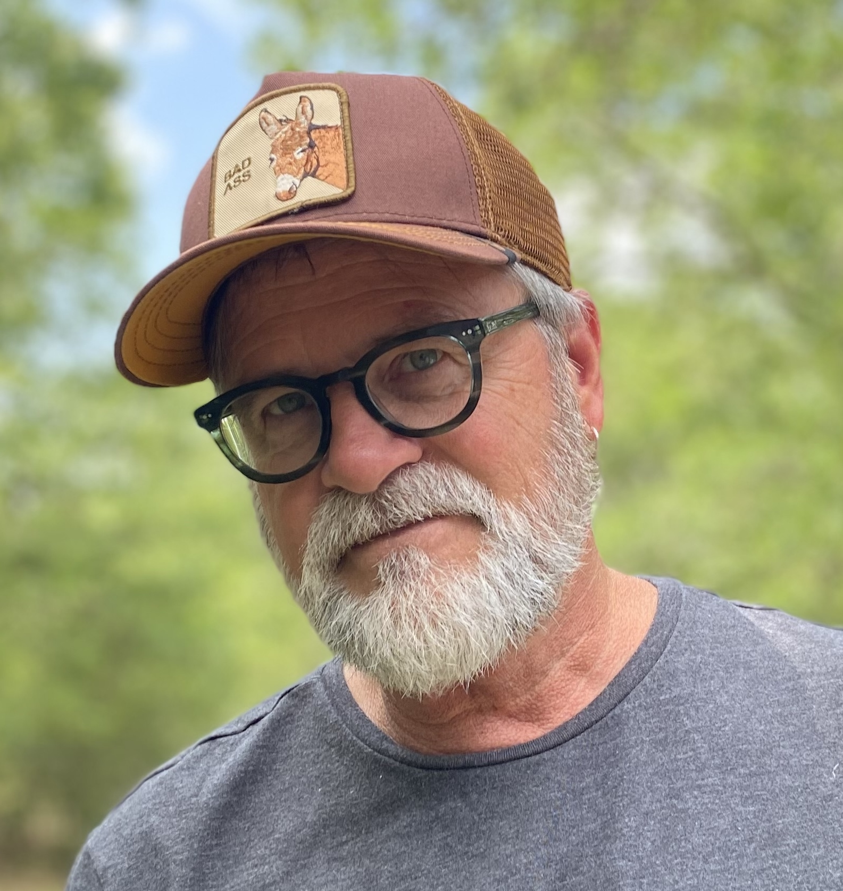

# About

John Krajicek is a folk country rock singer-songwriter, visual artist, host of the video podcast Time to Connect (YouTube), Mindfulness & Emotional Intelligence coach, and retired Professor (Texas A&M).

Born in Leavenworth, KS. Enchanted by Dylan and Lennon in his youth. College years in Denton, TX. Obsessively writes songs. Loves to play live.

John Prine, The Byrds, The Band, Joni Mitchell, Neil Young, REM, Wallace Stevens, Elizabeth Bishop, Townes Van Zandt, Natalie Merchant, Wilco, Will Johnson, Califone, Jason Lytle, Andrew Bird, Welch & Rawlings, Billy Collins, The Felice Brothers, Big Thief, on and on.

"Life isn't about finding yourself; or finding anything. Life is about creating yourself; and creating things." (Dylan)