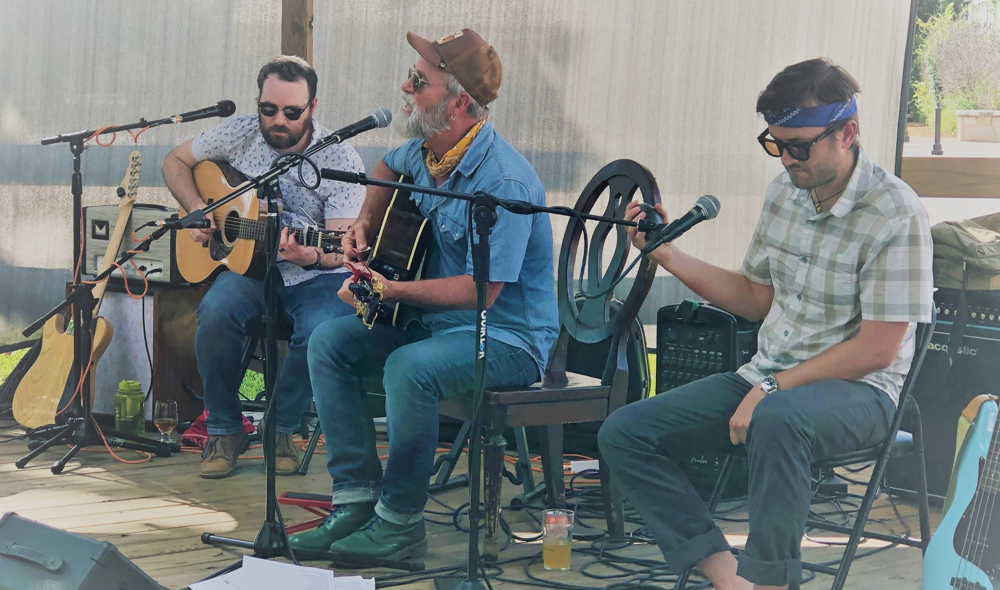

# Performances

UPCOMING SHOWS

[Cherrywood Coffeehouse, Austin](https://cherrywoodcoffeehouse.com/) – Steve Earle 69th Birthday Bash – Sunday, January 14, 2024, 3:00-5:00

[New Braunfels Brewing Company, NB](https://www.nbbrewtx.com/) – Saturday, February 3, 2024, 3:00-5:00

[Cowboy Surfer, Houston](https://cowboysurferbar.com/) – Wednesday, February 21, 2024, 6:00-9:00

[Lone Pint Brewery, Magnolia](https://lonepint.com/) – Saturday, April 6, 2024, 1:00-4:00

[Lone Pint Brewery, Magnolia](https://lonepint.com/) – Saturday, May 25, 2024, 1:00-4:00

[Marvin's Place Art Gallery, Ardmore OK ](https://marvinsplace.gallery/) (w/ Ed Rogers) – Friday, July 12, 2024, 6:30-8:30

[Lone Pint Brewery, Magnolia](https://lonepint.com/) – Saturday, September 21, 2024, 1:00-4:00

[Lone Pint Brewery, Magnolia](https://lonepint.com/) – Saturday, Novmeber 2, 2024, 1:00-4:00

PAST SHOWS:

[Lazy Oaks Beer Garden, Houston (w/ BJ Gamez & Josh Stuckey)](https://lazyoaksbeergarden.com/) – Friday, November 3, 2023, 7:00-10:00

[Curious Collections Vinyl Records & More, Bryan](https://curiouscollectionstx.com/) (with Ben Morris & Eric Fisher) – Sunday, September 17, 2023, 5:00-7:00

[Fortress BeerWorks, Spring](https://www.fortressbeerworks.com/) – Friday, July 21, 2023, 7:00-10:00

[Riley's Tavern, New Braunfels](https://www.rileystavern.com/) – Thursday, June 22, 2023, 7:00-10:00

[Southern Sky Music Cafe, Ingram](https://www.southernskymusiccafe.com/)– Friday, June 23, 2023, 6:30-9:00

[Hondo's on Main, Fredericksburg](https://www.hondosonmain.com/) – Saturday, June 24, 2023, 12:00-3:00

[Trailhead Beer Garden, Kerrville](https://trailheadbeergarden.com/) – Saturday, June 24, 2023, 7:30-9:30

[Hole in the Wall, Austin](https://www.holeinthewallaustin.com/) (opening for Mike Nicolai) – Sunday, June 25, 2023, 7:00-8:00

[Lone Pint Brewery, Magnolia](https://lonepint.com/) (with Kyle Littlefield) – Saturday, May 20, 2023, 1:00-4:00

[Cherrywood Coffeehouse, Austin](https://cherrywoodcoffeehouse.com/) – Sunday, May 7, 2023, 2:00-4:00

[Cinco Ranch (Aggies Helping Others Charity event), Houston](https://aggieshelpingothers.org/) – Friday, April 14, 2023, 1:30-3:00 

[4J Brewing Company, Houston](https://www.4jbrewingcompany.com/) (w/ Josh Stuckey) – Friday, March 31, 2023, 6:30-9:00

[The Village and Art979 Gallery, Bryan](https://www.thevillagedowntown.com/) – Friday, March 24, 2023, 6:00-8:00

[Lone Pint Brewery, Magnolia](https://lonepint.com/) – Saturday, March 25, 2023, 1:00-4:00

[Stiles Switch BBQ (SxSW), Austin](http://www.stilesswitchbbq.com/) – Saturday, March 18, 2023, 12:00-12:50

[Heights Drive Inn, Houston](https://www.heightsdriveinn.com/) – Wednesday, February 22, 2023, 6:00-8:30

[Lazy Oaks Beer Garden, Houston](https://lazyoaksbeergarden.com/) – Friday, January 27, 2023, 6:00-9:00

[Dan's Silverleaf, Denton (opening for Issac Hoskins)](https://danssilverleaf.com/) – Tuesday, January 17, 2023, 8:00-8:30

[Heights Drive Inn, Houston](https://www.heightsdriveinn.com/) – Friday, December 16, 2022, 6:00-9:00

[The 101, Bryan (First Friday)](https://www.facebook.com/101BCS/) – Friday, November 4, 2022, 5:30-7:30

[Cherrywood Coffeehouse, Austin](https://cherrywoodcoffeehouse.com/) – song swap with Kevin Peroni  – Sunday, November 13, 2022, 5:00-7:00

Booneville Days, Brazos Museum of Natural History, Bryan – Saturday, October 1, 2022, 9:30-10:30

[Lone Pint Brewery, Magnolia](https://lonepint.com/) – Saturday, September 10, 2022, 7:00-10:00

[The 101, Bryan (First Friday)](https://lonepint.com/) – Friday, July 1, 2022, 5:30-7:30

[4J Brewing Company, Houston (w/ BJ Gamez)](https://www.4jbrewingcompany.com/) – Friday, May 20, 2022, 5:00-7:00

[The 101, Bryan (Leavenworth's Last Gasp)](https://www.facebook.com/101BCS/) – Sunday, April 24, 2022, time TBA

[Downtown Bryan Street & Art Fair](https://www.downtownbryan.com/downtown-street-art-fair) – Saturday, April 9, 2022, 3:00-3:45

[Stiles Switch BBQ (SxSW), Austin](http://www.stilesswitchbbq.com/) – Sunday, March 20, 2022, 1:00-1:50

[Lone Pint Brewery, Magnolia (w/ Leavenworth)](https://lonepint.com/) – Saturday, March 12, 2022, 4:00-8:00

[Lone Pint Brewery, Magnolia](https://lonepint.com/) – Saturday, February 5, 2022, 1:00-5:00

[Smoky Rose, Dallas](https://www.smokyrose.com/) – Sunday, December 5, 2021, 6:00-8:00

[Cavalry Court, College Station](https://www.cavalrycourt.com/live-music-events.aspx) (w/ Jye Shafer & Kyle Littlefield) – Thursday, December 16, 2021

[Lone Pint Brewery, Magnolia (w/ Leavenworth)](https://lonepint.com/) – Saturday, November 20, 2021, 2:00-5:00

[Mo's Irish Pub, College Station](https://lonepint.com/) – Saturday, November 6, 2021, 5:30-7:30

[The 101, Bryan](https://lonepint.com/) – Friday, November 5, 2021, 5:00-7:00

[Fortress BeerWorks, Spring](https://lonepint.com/) – Saturday, October 30, 2021, 2:00-4:30

[Lone Pint Brewery, Magnolia (w/ Kyle Littlefield)](https://lonepint.com/) – Saturday, October 23, 2021, 6:00-9:00

[Cherrywood Coffeehouse, Austin](https://cherrywoodcoffeehouse.com/) – song swap with Kevin Peroni  – Tuesday, October 5, 2021, 6:00-7:30

[Smoky Rose, Dallas](https://www.smokyrose.com/) – Tuesday, September 28, 2021, 6:00-9:00

[Lone Pint Brewery, Magnolia](https://lonepint.com/) – Saturday, August 28, 2021, 6:00-9:00

[Lone Pint Brewery, Magnolia (w/ Jye Shafer & Ross Hudgins)](https://lonepint.com/) – Saturday, July 31, 2021

[Cavalry Court, College Station](https://www.cavalrycourt.com/live-music-events.aspx) – Wednesday, July 28, 2021

[Smoky Rose, Dallas](https://www.smokyrose.com/)  – Wednesday, July 21, 2021

[Benson's Tavern & Beer Garden, Salida, CO](https://www.facebook.com/Bensons-Tavern-Beer-Garden-71527323736/) – Friday, July 6, 2021

[Savage Brew Lab, Bryan](https://www.savagebrewlab.com) – Friday, June 25, 2021

[Cherrywood Coffeehouse, Austin](https://cherrywoodcoffeehouse.com/) – song swap with Kevin Peroni – Friday, May 28, 2021, 7:30-9:30

[The Post at River East, Fort Worth](http://thepostatrivereast.com/) – song swap with Jacob Furr – Thursday, May 13, 2021, 6:00-9:00

[Lone Pint Brewery, Magnolia](https://lonepint.com/) – Saturday, April 24, 2021, 12:30-3:30

[Downtown Bryan Street & Art Fair](https://www.downtownbryan.com/downtown-street-art-fair) – Saturday, April 10, 2021, 12-12:45

[Lone Pint Brewery, Magnolia](https://lonepint.com/) – Saturday, January 30, 2021, 12:30-3:30