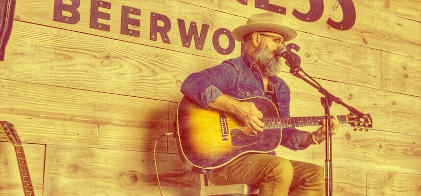

# Live Shows

UPCOMING SHOWS

[Lone Pint Brewery, Magnolia](https://lonepint.com/) – Saturday, March 25, 1:00-4:00

Cinco Ranch (Aggies Helping Others Charity event) – Friday, April 14, 1:30-3:00

[Lone Pint Brewery, Magnolia](https://lonepint.com/) – Saturday, May 20, 1:00-4:00

PAST SHOWS:

Lazy Oaks Beer Garden, Houston – Friday, January 27, 6:00-9:00

Dan's Silverleaf, Denton (opening for Issac Hoskins)  – Tuesday, January 17, 2023, 8:00-8:30

[The 101, Bryan (First Friday)](https://lonepint.com/) – Friday, November 4, 2022, 5:30-7:30

[Cherrywood Coffeehouse, Austin](https://cherrywoodcoffeehouse.com/) - song swap with Kevin Peroni - Sunday, November 13, 2022, 5:00-7:00Booneville Days, Brazos Museum of Natural History, Bryan – Saturday, October 1, 9:30-10:30

[Lone Pint Brewery, Magnolia](https://lonepint.com/) – Saturday, September 10, 7:00-10:00

[The 101, Bryan (First Friday)](https://lonepint.com/) – Friday, July 1, 2022, 5:30-7:30

[4J Brewing Company, Houston (w/ BJ Gamez)](https://lonepint.com/) – Friday, May 20, 2022, 5:00-7:00

[The 101, Bryan (Leavenworth's Last Gasp)](https://lonepint.com/) – Sunday, April 24, 2022, time TBA

[Downtown Bryan Street & Art Fair](https://www.downtownbryan.com/downtown-street-art-fair) – Saturday, April 9, 2022, 3:00-3:45

[Stiles Switch BBQ (SxSW), Austin](https://lonepint.com/) – Sunday, March 20, 2022, 1:00-1:50

[Lone Pint Brewery, Magnolia (w/ Leavenworth)](https://lonepint.com/) – Saturday, March 12, 2022, 4:00-8:00

[Lone Pint Brewery, Magnolia](https://lonepint.com/) – Saturday, February 5, 2022, 1:00-5:00

[Smoky Rose, Dallas](https://www.smokyrose.com/) - Sunday, December 5, 2021, 6:00-8:00

[Cavalry Court, College Station](https://www.cavalrycourt.com/live-music-events.aspx) (w/ Jye Shafer & Kyle Littlefield) – Thursday, December 16, 2021

[Lone Pint Brewery, Magnolia (w/ Leavenworth)](https://lonepint.com/) – Saturday, November 20, 2021, 2:00-5:00

[Mo's Irish Pub, College Station](https://lonepint.com/) - Saturday, November 6, 2021, 5:30-7:30

[The 101, Bryan](https://lonepint.com/) - Friday, November 5, 2021, 5:00-7:00

[Fortress BeerWorks, Spring](https://lonepint.com/) - Saturday, October 30, 2021, 2:00-4:30

[Lone Pint Brewery, Magnolia (w/ Kyle Littlefield)](https://lonepint.com/) – Saturday, October 23, 2021, 6:00-9:00

[Cherrywood Coffeehouse, Austin](https://cherrywoodcoffeehouse.com/) - song swap with Kevin Peroni - Tuesday, October 5, 2021, 6:00-7:30

[Smoky Rose, Dallas](https://www.smokyrose.com/) - Tuesday, September 28, 2021, 6:00-9:00

[Lone Pint Brewery, Magnolia](https://lonepint.com/) – Saturday, August 28, 2021, 6:00-9:00

[Lone Pint Brewery, Magnolia (w/ Jye Shafer & Ross Hudgins)](https://lonepint.com/) – Saturday, July 31, 2021

[Cavalry Court, College Station](https://www.cavalrycourt.com/live-music-events.aspx) – Wednesday, July 28, 2021

[Smoky Rose, Dallas](https://www.smokyrose.com/) - Wednesday, July 21

[Benson's Tavern & Beer Garden, Salida, CO](https://www.facebook.com/Bensons-Tavern-Beer-Garden-71527323736/) – Friday, July 6, 2021

[Savage Brew Lab, Bryan](https://www.savagebrewlab.com) – Friday, June 25, 2021

[Cherrywood Coffeehouse, Austin](https://cherrywoodcoffeehouse.com/) - song swap with Kevin Peroni - Friday, May 28, 2021, 7:30-9:30

[The Post at River East, Fort Worth](http://thepostatrivereast.com/) - song swap with Jacob Furr - Thursday, May 13, 2021, 6:00-9:00

[Lone Pint Brewery, Magnolia](https://lonepint.com/) – Saturday, April 24, 2021, 12:30-3:30

[Downtown Bryan Street & Art Fair](https://www.downtownbryan.com/downtown-street-art-fair) – Saturday, April 10, 2021, 12-12:45

[Lone Pint Brewery, Magnolia](https://lonepint.com/) – Saturday, January 30, 2021, 12:30-3:30